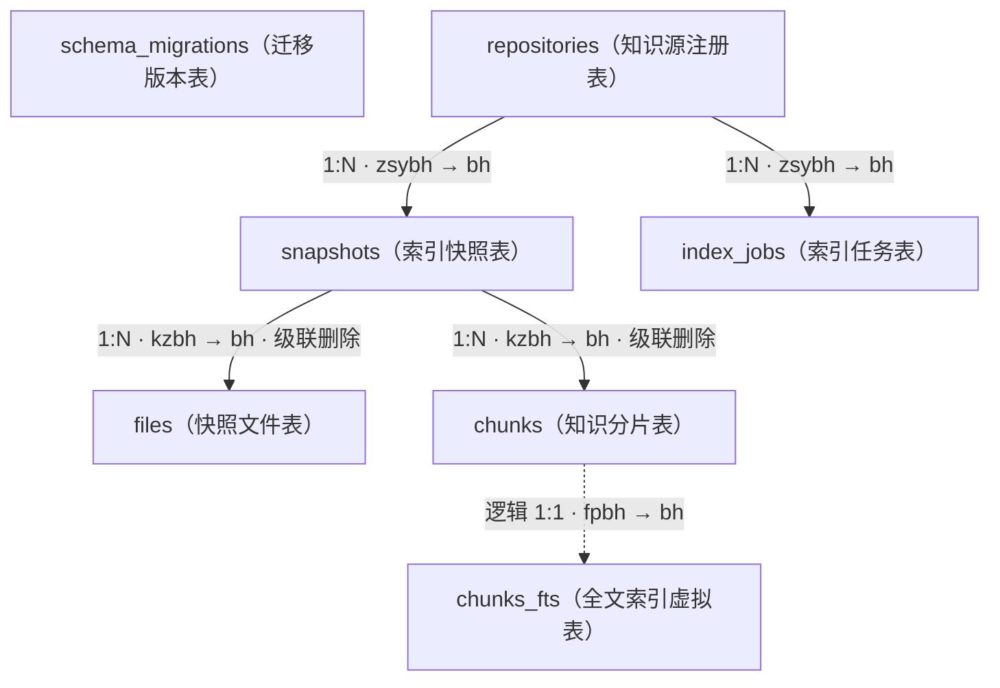

# Local RAG 数据库表结构说明（拼音首字母字段）

本文档描述 `data/sqlite/rag.db` 的 SQLite 物理表结构。自迁移
`002_pinyin_initial_columns.sql` 起，业务表字段使用中文含义的拼音首字母命名；表名继续
使用原英文名称，以保持数据库对象职责清晰，并降低迁移风险。

> “备注”是本文档用于解释字段约束、枚举和使用方式的说明列，不是数据库中的独立字段。

## 1. 命名规则

- 字段名取中文业务含义的拼音首字母，例如“创建时间”使用 `cjsj`。
- 主键统一优先使用 `bh`（编号）。
- 外键在业务对象前加对象缩写，例如“知识源编号”使用 `zsybh`，“快照编号”使用 `kzbh`。
- 时间均保存为带 UTC 时区的 ISO 8601 文本。
- 布尔值以 SQLite `INTEGER` 保存：`0` 表示否，`1` 表示是。
- JSON 数据以 `TEXT` 保存，字段名保留 `_json` 后缀以提示序列化格式。
- SHA-256、Git SHA 和 ULID 均以 `TEXT` 保存，不做数值运算。

## 2. 表关系

以下关系图采用兼容性较好的 Mermaid `graph` 语法。实线表示 SQLite 中实际声明的
外键，虚线表示由应用代码维护、但数据库未声明外键的逻辑关系。



`schema_migrations` 是独立的迁移控制表，不参与业务表外键关系。

不支持 Mermaid 的阅读器可参考以下等价关系：

```text
repositories.bh
├─< snapshots.zsybh
│   ├─< files.kzbh       (ON DELETE CASCADE)
│   └─< chunks.kzbh      (ON DELETE CASCADE)
│       └── chunks_fts.fpbh ──> chunks.bh  [应用维护的逻辑 1:1]
└─< index_jobs.zsybh

schema_migrations        [独立迁移控制表]
```

### 2.1 关系与约束摘要

| 父表 | 子表 | 关联字段 | 基数 | 数据库约束 | 删除行为 | 备注 |
|---|---|---|---|---|---|---|
| `repositories` | `snapshots` | `snapshots.zsybh → repositories.bh` | 1:N | 物理外键 | RESTRICT | 存在快照时不能直接删除知识源。 |
| `repositories` | `index_jobs` | `index_jobs.zsybh → repositories.bh` | 1:N | 物理外键 | RESTRICT | 存在索引任务时不能直接删除知识源。 |
| `snapshots` | `files` | `files.kzbh → snapshots.bh` | 1:N | 物理外键 | CASCADE | 删除快照会自动删除所属文件记录。 |
| `snapshots` | `chunks` | `chunks.kzbh → snapshots.bh` | 1:N | 物理外键 | CASCADE | 删除快照会自动删除所属知识分片。 |
| `chunks` | `chunks_fts` | `chunks_fts.fpbh → chunks.bh` | 逻辑 1:1 | 无物理外键 | 应用维护 | `save_chunks()` 同步写入；迁移时可由 `chunks` 全量重建。 |

### 2.2 容易混淆的字段

- `chunks.zsybh` 是为检索和结果装配保留的冗余知识源编号，当前没有直接声明到
  `repositories.bh` 的外键；其一致性通过 `chunks.kzbh → snapshots.bh` 的所属关系保证。
- `files` 使用复合主键 `(kzbh, lj)`，其中只有 `kzbh` 同时是外键。Mermaid ER 语法中的
  `PK_FK` 并非通用合法标记，也是原关系图无法渲染的主要原因。
- `chunks_fts` 是 FTS5 虚拟表。它保存可重建的检索索引，不是正文的事实数据源。

## 3. `schema_migrations`：迁移版本表

作用：记录已执行的 SQL 迁移，保证数据库初始化和升级脚本只应用一次。该表由
`SqliteStore.initialize()` 在执行其他迁移前创建和维护。

| 字段 | 中文全称 | 原英文字段 | 类型 | 约束 | 用途与备注 |
|---|---|---|---|---|---|
| `bb` | 版本 | `version` | TEXT | 主键，非空 | 保存迁移文件名，例如 `002_pinyin_initial_columns.sql`；用于判断迁移是否已执行。 |
| `yysj` | 应用时间 | `applied_at` | TEXT | 非空 | 迁移成功写入数据库的 UTC 时间。 |

## 4. `repositories`：知识源注册表

作用：保存可索引知识源的注册信息。虽然表名沿用 `repositories`，其中既可以保存本地 Git
仓库，也可以保存白名单 HTTPS 单页。

| 字段 | 中文全称 | 原英文字段 | 类型 | 约束 | 用途与备注 |
|---|---|---|---|---|---|
| `bh` | 编号 | `id` | TEXT | 主键，非空 | 知识源稳定标识；用于 CLI 的 `--repo` 和 API 的 `repo_ids`。 |
| `mc` | 名称 | `name` | TEXT | 非空 | 面向用户展示的知识源名称。 |
| `lylx` | 来源类型 | `source_type` | TEXT | 非空 | `working_tree`、`local_mirror`、`web_page` 或保留的 `remote_clone`。 |
| `lydz` | 来源地址 | `source_uri` | TEXT | 非空 | Git 本地路径或 HTTPS 页面 URL。可能包含本机目录信息，不应随意写入公开日志。 |
| `mryy` | 默认引用 | `default_ref` | TEXT | 非空 | Git 分支/tag/commit 引用；网页源通常为 `live`。 |
| `sfqy` | 是否启用 | `enabled` | INTEGER | 非空，默认 1 | 控制知识源是否启用；`1` 为启用，`0` 为停用。 |
| `bhx_json` | 包含项 JSON | `include_json` | TEXT | 非空，默认 `[]` | 文件包含规则数组；为空时按默认文本类型发现规则处理。 |
| `pcx_json` | 排除项 JSON | `exclude_json` | TEXT | 非空，默认 `[]` | 文件排除规则数组，与系统默认规则和 `.ragignore` 共同生效。 |
| `cjsj` | 创建时间 | `created_at` | TEXT | 非空 | 首次注册时间。冲突更新时保留原值。 |
| `gxsj` | 更新时间 | `updated_at` | TEXT | 非空 | 最近一次注册信息更新的时间。 |

## 5. `snapshots`：索引快照表

作用：记录每个知识源、内容版本和索引版本的构建结果。查询只读取 `published` 快照，失败
或构建中的快照不会对用户可见。

| 字段 | 中文全称 | 原英文字段 | 类型 | 约束 | 用途与备注 |
|---|---|---|---|---|---|
| `bh` | 编号 | `id` | TEXT | 主键，非空 | 快照 ULID；同时用于 Qdrant collection 命名。 |
| `zsybh` | 知识源编号 | `repo_id` | TEXT | 外键，非空 | 关联 `repositories.bh`。 |
| `bbhs` | 版本哈希 | `commit_sha` | TEXT | 非空 | Git 源保存 commit SHA；网页源保存清洗正文的 SHA-256。 |
| `sybb` | 索引版本 | `index_version` | TEXT | 非空 | 由 Embedding fingerprint 和 chunker version 计算，用于隔离索引语义。 |
| `zt` | 状态 | `status` | TEXT | 非空，CHECK | `pending`、`running`、`validating`、`published`、`failed`、`superseded`。 |
| `tjxx_json` | 统计信息 JSON | `stats_json` | TEXT | 可空 | 发布时保存文件数、chunk 数、跳过数等统计数据。 |
| `cwxx` | 错误信息 | `error_message` | TEXT | 可空 | 构建失败原因，最多由应用写入前 2000 个字符；成功重试时清空。 |
| `cjsj` | 创建时间 | `created_at` | TEXT | 非空 | 快照开始构建或重新尝试的时间。 |
| `fbsj` | 发布时间 | `published_at` | TEXT | 可空 | 成功发布时间；仅 `published` 快照有值。 |

组合唯一约束：`(zsybh, bbhs, sybb)`，防止同一知识源的同一内容和索引配置产生重复快照。

## 6. `files`：快照文件表

作用：保存每个快照实际纳入索引的文件或网页文档，便于统计、解析诊断和数据追踪。

| 字段 | 中文全称 | 原英文字段 | 类型 | 约束 | 用途与备注 |
|---|---|---|---|---|---|
| `kzbh` | 快照编号 | `snapshot_id` | TEXT | 联合主键、外键，非空 | 关联 `snapshots.bh`；删除快照时级联删除文件记录。 |
| `lj` | 路径 | `path` | TEXT | 联合主键，非空 | Git 文件相对路径；网页源为完整 URL。 |
| `dxhs` | 对象哈希 | `blob_sha` | TEXT | 非空 | Git blob SHA 或网页正文 SHA-256，用于内容版本追踪。 |
| `yy` | 语言 | `language` | TEXT | 非空 | 检测后的语言，如 `python`、`markdown`、`text`。 |
| `jxzt` | 解析状态 | `parse_status` | TEXT | 非空 | 当前为 `fallback`；未来接入 AST parser 后可记录精确解析状态。 |
| `nrzjs` | 内容字节数 | `content_bytes` | INTEGER | 非空 | 原始可索引文本的字节数，用于大小统计和异常诊断。 |

联合主键：`(kzbh, lj)`，同一快照中的同一路径只保存一次。

## 7. `chunks`：知识分片表

作用：保存结构化切分后的完整文本、来源定位、Embedding 输入和检索元数据，是引用回填与
关键词检索的事实数据源。

| 字段 | 中文全称 | 原英文字段 | 类型 | 约束 | 用途与备注 |
|---|---|---|---|---|---|
| `bh` | 编号 | `id` | TEXT | 主键，非空 | 确定性 chunk SHA-256；相同输入和切分版本得到相同编号。 |
| `xldbh` | 向量点编号 | `point_id` | TEXT | 唯一，非空 | 由 chunk 编号计算的 UUIDv5，对应 Qdrant point ID。 |
| `kzbh` | 快照编号 | `snapshot_id` | TEXT | 外键，非空 | 关联 `snapshots.bh`；删除快照时级联删除分片。 |
| `zsybh` | 知识源编号 | `repo_id` | TEXT | 非空 | 冗余保存知识源编号，加速过滤与检索结果装配。 |
| `bbhs` | 版本哈希 | `commit_sha` | TEXT | 非空 | Git commit SHA 或网页正文 SHA-256，用于生成稳定引用。 |
| `lj` | 路径 | `path` | TEXT | 非空 | Git 相对路径或网页 URL。 |
| `yy` | 语言 | `language` | TEXT | 非空 | 分片语言，可作为查询过滤条件。 |
| `fh` | 符号 | `symbol` | TEXT | 可空 | Markdown 标题、类名或函数名；无结构符号时为空。 |
| `jdlx` | 节点类型 | `node_type` | TEXT | 非空 | 如 `section`、`symbol`、`preamble` 或 `text`。 |
| `qsh` | 起始行 | `start_line` | INTEGER | 非空 | 分片起始行；Git 对应源文件，网页对应清洗后的 Markdown。 |
| `jsh` | 结束行 | `end_line` | INTEGER | 非空 | 分片结束行，包含该行。 |
| `nr` | 内容 | `content` | TEXT | 非空 | 展示、引用和生成上下文使用的规范化正文。 |
| `xlwb` | 向量文本 | `embedding_text` | TEXT | 非空 | 送入 Embedding 模型的文本，包含 repo/path/symbol/lines 等检索提示头。 |
| `nrhs` | 内容哈希 | `content_hash` | TEXT | 非空 | 规范化正文 SHA-256；用于融合结果去重和未来向量缓存。 |
| `sfcs` | 是否测试 | `is_test` | INTEGER | 非空，默认 0 | 标记测试路径；`1` 为测试代码或测试文档。 |
| `ysj_json` | 元数据 JSON | `metadata_json` | TEXT | 非空 | 扩展元数据对象；当前通常为 `{}`，避免频繁改表。 |

主要索引：快照编号 `kzbh`、知识源与路径 `(zsybh, lj)`、内容哈希 `nrhs`。

## 8. `chunks_fts`：知识分片全文索引

作用：SQLite FTS5 虚拟表，为路径、符号和正文提供关键词检索，与 Qdrant 稠密向量结果
通过 RRF 融合。该表是 `chunks` 的可重建派生索引，不应作为正文事实来源。

| 字段 | 中文全称 | 原英文字段 | 类型 | 索引方式 | 用途与备注 |
|---|---|---|---|---|---|
| `fpbh` | 分片编号 | `chunk_id` | TEXT | UNINDEXED | 对应 `chunks.bh`，用于将 FTS 命中回填为完整分片。 |
| `kzbh` | 快照编号 | `snapshot_id` | TEXT | UNINDEXED | 限定只检索当前 published snapshot。 |
| `zsybh` | 知识源编号 | `repo_id` | TEXT | UNINDEXED | 保存来源归属，不参与分词。 |
| `lj` | 路径 | `path` | TEXT | FTS5 | 检索文件路径、目录和 URL。 |
| `fh` | 符号 | `symbol` | TEXT | FTS5 | 检索标题、类名、函数名和其他符号。 |
| `nr` | 内容 | `content` | TEXT | FTS5 | 检索分片正文；使用 `unicode61` tokenizer。 |

FTS5 的 `bm25()` 权重顺序与字段位置相关，修改本表字段顺序时必须同步检查
`SqliteStore.search_lexical()`。

## 9. `index_jobs`：索引任务表

作用：SQLite 持久化任务队列。API/CLI 创建任务，Worker 原子领取最早的 pending 任务，
并记录执行结果和故障信息。

| 字段 | 中文全称 | 原英文字段 | 类型 | 约束 | 用途与备注 |
|---|---|---|---|---|---|
| `bh` | 编号 | `id` | TEXT | 主键，非空 | 索引任务 ULID。 |
| `zsybh` | 知识源编号 | `repo_id` | TEXT | 外键，非空 | 关联 `repositories.bh`。 |
| `qqyy` | 请求引用 | `requested_ref` | TEXT | 非空 | 用户提交的 Git ref；网页源通常为 `live`。 |
| `yjxbbhs` | 已解析版本哈希 | `resolved_commit_sha` | TEXT | 可空 | Worker 解析得到的 Git commit SHA 或网页正文 SHA-256。 |
| `zt` | 状态 | `status` | TEXT | 非空，CHECK | `pending`、`running`、`succeeded` 或 `failed`。 |
| `cscs` | 尝试次数 | `attempt` | INTEGER | 非空，默认 0 | Worker 每次成功领取任务时加 1。 |
| `cwdm` | 错误代码 | `error_code` | TEXT | 可空 | 稳定机器错误码，例如 `MODEL_UNAVAILABLE`。 |
| `cwxx` | 错误信息 | `error_message` | TEXT | 可空 | 面向诊断的失败详情，不应包含 secret 原文。 |
| `cjsj` | 创建时间 | `created_at` | TEXT | 非空 | 任务提交时间，用于 pending 队列排序。 |
| `kssj` | 开始时间 | `started_at` | TEXT | 可空 | Worker 首次领取任务的时间。 |
| `jssj` | 结束时间 | `finished_at` | TEXT | 可空 | 成功或失败完成的时间。 |
| `xtsj` | 心跳时间 | `heartbeat_at` | TEXT | 可空 | Worker 运行期间周期更新；启动时据此恢复超时的 running 任务。 |
| `xccssj` | 下次重试时间 | `next_retry_at` | TEXT | 可空 | 可重试故障的最早重新领取时间；成功、最终失败或 stale 恢复时清空。 |
| `kzbh` | 快照编号 | `snapshot_id` | TEXT | 可空，外键 | 记录本任务实际构建或复用的快照；恢复时只据此快照判断发布是否完成，删除快照时置空。 |

主要索引：`(zt, cjsj)` 兼容原有队列访问；`(zt, xccssj, cjsj)` 用于领取已经到达退避时间的
pending 任务。

## 10. 迁移与兼容说明

- `001_initial.sql` 保留原始英文字段 schema，确保已有数据库的迁移历史可追溯。
- `002_pinyin_initial_columns.sql` 通过 `ALTER TABLE ... RENAME COLUMN` 保留原表数据、主键、
  外键和普通索引。
- `003_job_recovery.sql` 最初增加 `index_jobs.xcchs`、`index_jobs.kzbh` 和重试领取索引，
  为 Worker 心跳恢复、有上限重试和指数退避提供持久化状态；同时用部分唯一索引保证
  每个知识源最多只有一个 `published` 快照。
- `004_correct_retry_column_initials.sql` 将命名不完整的 `xcchs` 原位更名为 `xccssj`，
  严格对应“下次重试时间”的六个中文业务字首字母，并保留已有重试时间数据。
- `005_correct_metadata_column_initials.sql` 将重复字母的 `ysjj_json` 原位更名为
  `ysj_json`，严格对应“元数据”的拼音首字母，并保留 `_json` 格式后缀。
- FTS5 虚拟表不支持同样的字段改名流程，因此迁移会删除并从 `chunks` 全量重建
  `chunks_fts`；正文事实数据不会丢失。
- `schema_migrations` 在普通迁移执行前由初始化代码将 `version/applied_at` 改为
  `bb/yysj`，使后续迁移可以继续正常登记。
- Python 领域模型、CLI 参数和 HTTP API 字段继续使用英文，以保持外部接口兼容；仅
  SQLite 物理列名使用拼音首字母。
- 执行生产或重要本地库升级前应备份数据库文件及对应的 `-wal`、`-shm` 文件，并在升级后
  执行 `PRAGMA foreign_key_check` 和 FTS5 检索验证。
