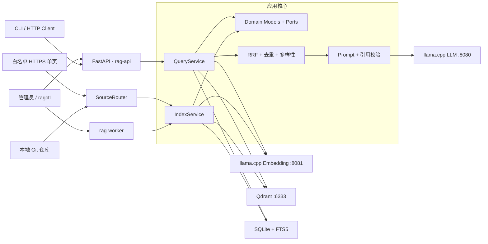
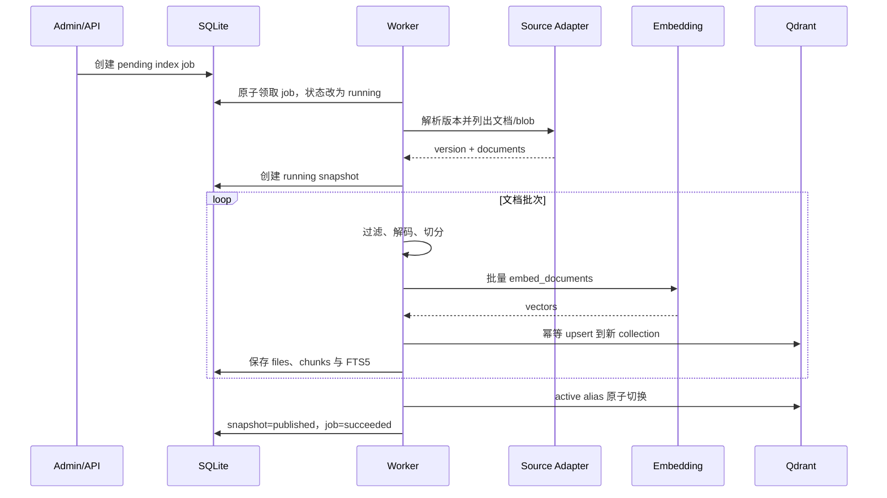
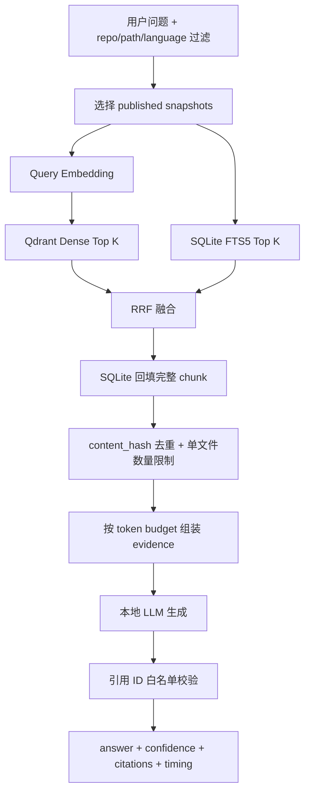

# Local RAG

面向本地 Git 仓库和白名单 HTTPS 单页的知识检索与问答系统。项目采用六边形架构，
以 FastAPI、llama.cpp、Qdrant 和 SQLite FTS5 组成完全本地的 RAG 闭环，并通过
snapshot 隔离、原子发布和服务端引用校验保证索引与回答可追溯。

## 1. 项目定位

### 1.1 当前能力

- 注册本地 working tree、bare mirror 和白名单 HTTPS 单页知识源。
- Git 源固定到 commit SHA；网页源以清洗后正文的 SHA-256 作为版本。
- 读取 Git tree/blob，不执行仓库代码、脚本或 hook。
- 过滤二进制、超大文件、常见生成目录、密钥和 `.ragignore` 命中路径。
- 按 Markdown 标题、常见代码符号或文本窗口进行确定性切分。
- 使用本地 llama.cpp 批量生成文档向量和查询向量。
- 使用 Qdrant 稠密检索与 SQLite FTS5 关键词检索，并以 RRF 融合排序。
- 按内容去重并限制单文件 chunk 数，避免上下文被单一文件占满。
- 以 `[E1]` 等短证据 ID 生成回答，由服务端映射真实路径、行号和版本。
- 提供 FastAPI、CLI、后台 Worker、任务状态、健康检查和结构化日志。

### 1.2 技术栈

| 组件 | 职责 |
|---|---|
| FastAPI | 查询、搜索、管理和健康检查 API |
| llama.cpp LLM | 基于证据生成最终回答 |
| llama.cpp Embedding | 文档与查询向量化 |
| Qdrant | 稠密向量索引、检索及 active alias |
| SQLite + FTS5 | 仓库、任务、快照、chunk 元数据与关键词检索 |
| Git CLI | 固定 commit、tree/blob 枚举和内容读取 |
| Typer | `ragctl` 管理 CLI |

## 2. 总体架构



架构遵循“核心业务依赖抽象端口，外部能力由 adapter 实现”的方向：

- `domain` 只定义模型、错误和协议，不依赖 FastAPI、Qdrant 或 llama.cpp。
- `application` 编排索引和查询用例，不直接处理 HTTP、SQL 或进程生命周期。
- `ingestion`、`infrastructure` 是输入与输出 adapter，负责外部系统细节。
- `api`、`cli` 和 `worker` 是驱动入口，共用同一组应用服务。
- SQLite 是任务和快照的事实状态；Qdrant 专注稠密向量，不承担业务状态管理。

### 2.1 运行进程与边界

| 进程/服务 | 默认地址 | 职责 |
|---|---|---|
| `rag-api` | `127.0.0.1:8000` | 用户查询、证据搜索、管理接口和健康检查 |
| `rag-worker` | 无监听端口 | 异步消费索引任务，抓取、过滤、切分和发布索引 |
| LLM 服务 | `127.0.0.1:8080` | 加载生成模型并提供 OpenAI 兼容接口 |
| Embedding 服务 | `127.0.0.1:8081` | 加载向量模型并提供批量 Embedding 接口 |
| Qdrant | `127.0.0.1:6333` | 保存 snapshot collection 和 active alias |
| SQLite | 本地文件 | 保存元数据、任务、快照、chunk 和 FTS5 索引 |

所有后端服务默认仅监听 loopback；普通用户只访问 `rag-api`。全量索引由 Worker
执行，不占用 API 请求线程。网页抓取仅允许 `ingestion.web_allowed_hosts` 中列出的
HTTPS 主机，并对每次重定向重新校验目标。

## 3. 架构目录

以下目录与当前代码一致：

<!-- BEGIN AUTO-GENERATED: PROJECT-STRUCTURE -->
```text
RAG-Project/
├─ config/  # 应用配置与日志配置
│  ├─ default.yaml
│  └─ logging.yaml
├─ evals/  # 评估问题和预期证据
│  ├─ expected_evidence.jsonl
│  └─ questions.jsonl
├─ migrations/  # SQLite schema 与迁移
│  ├─ 001_initial.sql
│  └─ 002_pinyin_initial_columns.sql
├─ prompts/  # 回答约束与 evidence 模板
│  ├─ answer_context.txt
│  └─ answer_system.txt
├─ scripts/  # Windows/Linux 启动和运维脚本
│  ├─ dev.ps1
│  ├─ dev.sh
│  ├─ launch-detached.py
│  ├─ rag-env.ps1
│  ├─ start-qdrant-local.ps1
│  └─ worker.ps1
├─ skills/  # 项目专用 Codex 技能
│  └─ sync-readme-structure/
│     ├─ agents/
│     │  └─ openai.yaml
│     ├─ scripts/
│     │  └─ sync_readme_structure.py
│     └─ SKILL.md
├─ src/
│  └─ rag/  # RAG 主程序包
│     ├─ api/  # FastAPI 路由、DTO、依赖和异常映射
│     │  ├─ __init__.py
│     │  ├─ admin_routes.py
│     │  ├─ app.py
│     │  ├─ dependencies.py
│     │  ├─ query_routes.py
│     │  └─ schemas.py
│     ├─ application/  # 索引与查询应用用例
│     │  ├─ __init__.py
│     │  ├─ index_service.py
│     │  └─ query_service.py
│     ├─ cli/  # ragctl 命令入口
│     │  ├─ __init__.py
│     │  └─ main.py
│     ├─ domain/  # 领域模型、端口和错误
│     │  ├─ __init__.py
│     │  ├─ errors.py
│     │  ├─ models.py
│     │  └─ ports.py
│     ├─ evaluation/
│     │  ├─ __init__.py
│     │  └─ retrieval.py
│     ├─ generation/  # Prompt 构建与引用校验
│     │  ├─ __init__.py
│     │  ├─ citation_validator.py
│     │  └─ prompt_builder.py
│     ├─ infrastructure/  # 模型、Qdrant、SQLite 和配置 adapter
│     │  ├─ __init__.py
│     │  ├─ llama_client.py
│     │  ├─ qdrant_store.py
│     │  ├─ settings.py
│     │  └─ sqlite_store.py
│     ├─ ingestion/  # 知识源、过滤与结构化切分
│     │  ├─ chunkers/
│     │  │  ├─ __init__.py
│     │  │  └─ structured.py
│     │  ├─ __init__.py
│     │  ├─ discovery.py
│     │  ├─ git_source.py
│     │  ├─ source_router.py
│     │  └─ web_source.py
│     ├─ retrieval/  # RRF 融合、多样性与证据上下文
│     │  ├─ __init__.py
│     │  ├─ context_builder.py
│     │  └─ fusion.py
│     ├─ worker/  # SQLite 索引任务消费者
│     │  ├─ __init__.py
│     │  └─ main.py
│     ├─ __init__.py
│     └─ container.py
├─ tests/  # 单元测试、集成测试和 fixtures
│  ├─ fixtures/
│  │  └─ sample_repo/
│  │     ├─ src/
│  │     │  └─ auth.py
│  │     └─ README.md
│  ├─ integration/
│  │  ├─ test_api_health.py
│  │  └─ test_sqlite_store.py
│  └─ unit/
│     ├─ test_chunker.py
│     ├─ test_citations.py
│     ├─ test_discovery.py
│     ├─ test_fusion.py
│     ├─ test_retrieval_evaluation.py
│     ├─ test_sync_readme_structure.py
│     └─ test_web_source.py
├─ .env.example
├─ .ragignore.example
├─ AGENTS.md  # 项目级 Codex 执行规则
├─ pyproject.toml  # 项目元数据、依赖与工具配置
├─ README.md  # 项目入口与架构说明
├─ start.bat  # Windows 一键启动入口
└─ start.ps1  # Windows 启动编排脚本
```
<!-- END AUTO-GENERATED: PROJECT-STRUCTURE -->

### 3.1 分层依赖

```text
api / cli / worker
        │
        ▼
    application
        │
        ▼
      domain
        ▲
        │ implements ports
ingestion / infrastructure / retrieval / generation
```

依赖方向始终指向核心。外部 adapter 可以替换，但 `IndexService`、`QueryService` 和
领域模型不需要了解具体 HTTP 客户端、数据库驱动或向量数据库 SDK。

## 4. 核心设计方案

### 4.1 知识源与版本模型

`SourceRouter` 根据 `source_type` 选择 adapter：

- `working_tree`：读取现有本地 clone。
- `local_mirror`：读取本地 bare mirror。
- `web_page`：抓取一张白名单 HTTPS 页面，提取 `<main>` 正文并转换为 Markdown。
- `remote_clone`：领域模型保留该类型，但当前未启用远程 clone/fetch。

Git 分支名在索引时解析为不可变 commit SHA；网页正文清洗后计算 SHA-256。两者都作为
snapshot 的版本标识，因此同一版本可以复用已发布快照，内容变化则生成新快照。

### 4.2 文件发现、安全过滤与切分

索引前依次执行路径排除、大小限制、文本编码检测和 secret 检测。默认排除 `.git`、
`node_modules`、`dist`、`build`、虚拟环境、二进制、压缩包、密钥及 `.env`；仓库可用
`.ragignore` 和注册时的 include/exclude 进一步控制范围。

当前 `StructuredChunker` 采用确定性回退策略：

- Markdown 按标题章节切分。
- 常见代码按类、函数、接口等符号边界切分。
- 其他文本按有限重叠的行窗口切分。
- chunk 携带 repo、版本、路径、语言、符号和行号；Git 行号对应源文件，网页行号对应清洗后的 Markdown 正文。

标识计算方式：

```text
chunk_id    = sha256(repo | version | path | start_line | end_line | chunker_version)
content_hash = sha256(normalized_content)
point_id     = UUIDv5(namespace, chunk_id)
index_version = sha256(embedding_fingerprint | chunker_version)[:16]
```

确定性 ID 使相同任务可以安全重试；`content_hash` 用于融合结果去重。目标语言的
Tree-sitter grammar 尚未绑定，解析状态当前记录为 `fallback`。

### 4.3 索引构建与原子发布



每个仓库、每个 snapshot 使用独立 Qdrant collection；查询只访问
`repo_<repo_id>__active` alias 和 SQLite 中的 `published` snapshot。构建失败时快照与
任务均标记为 `failed`，不会暴露半成品；同一版本稍后可复用失败快照 ID重新执行。

当前实现每次内容版本变化会构建完整新快照。跨 snapshot 的 Embedding cache 和未变化
chunk 复制属于后续增量优化，不应与当前的“同版本已发布快照复用”混淆。

### 4.4 混合检索与回答生成



RRF 使用排名而非直接混合不同量纲的向量分数与 FTS5 分数：

```text
score(document) = Σ 1 / (rrf_k + rank_i(document))
```

默认检索参数位于 `config/default.yaml`：Dense 30、FTS5 30、融合候选 50、最终 8，且每个
文件最多保留 3 个 chunk。问题中出现 `QueryService`、`default.yaml` 等明确代码标识符时，
融合结果会施加小幅、确定性的精确符号/路径提升。对于 `IndexService` 等 CamelCase 类名，
系统还会优先同名模块中的实现块，并降低只有类声明而没有实现内容的空壳块；普通自然语言单词
不触发这些提升。上下文采用带边界的 `<evidence>` 块，仓库内容只被视为资料，不被视为系统指令。

模型只能引用本轮上下文中存在的 `E1`、`E2` 等 ID。服务端从 evidence map 生成真实
repo、版本、路径、行号和 snippet；如果没有合法引用，则返回低置信度的“证据不足”，
而不是接受模型自行编造的引用位置。

### 4.5 数据职责与一致性

| 数据 | 存储位置 | 设计原因 |
|---|---|---|
| Repository、Job、Snapshot | SQLite | 事务化事实状态和失败恢复 |
| File、Chunk 正文和元数据 | SQLite | 行号引用、内容回填和 FTS5 |
| 关键词索引 | SQLite FTS5 | 路径、符号、错误码和技术词精确召回 |
| 向量与检索 payload | Qdrant | 高效相似度检索和 metadata filter |
| 当前可查询版本 | SQLite published 状态 + Qdrant alias | 防止查询看到半构建数据 |

SQLite 启用 WAL、foreign keys 和 busy timeout。发布顺序是先激活 Qdrant alias，再将
SQLite snapshot 标记为 published；失败任务保留错误码和错误消息以便诊断和重试。

### 4.6 关键设计决策

- 固定不可变版本：Git 使用 commit SHA，网页使用正文 hash，避免浮动分支或页面变化导致引用漂移。
- 索引与 API 分离：Worker 承担耗时任务，API 只负责提交、查询和读取状态。
- 双路检索：Dense 处理语义相似，FTS5 处理路径、标识符、错误码和精确技术词。
- RRF 融合：避免人为校准两个不同分数空间，参数少且结果稳定。
- Snapshot 隔离：新索引写入独立 collection，完成后切 alias，不发布半成品。
- 服务端引用映射：模型只选择证据 ID，真实来源信息由可信代码生成。
- 默认本地与最小权限：模型端点限制 loopback，网页源限制 HTTPS 与主机白名单。
- 失败可重放：任务和快照记录完整状态，确定性 ID 支持安全重试。

## 5. 快速启动

### 5.1 一键启动

```powershell
Set-Location E:\RAG-Project
.\start.bat
```

脚本会检查 Qdrant、LLM 和 Embedding，初始化数据库，并在后台启动 API 与 Worker。
重复执行不会重复拉起进程；重启应用进程使用：

```powershell
.\start.bat -Restart
```

可选参数：`-SkipWorker`、`-SkipDependencySync`。

### 5.2 手动准备和诊断

```powershell
Set-Location E:\RAG-Project
.\scripts\rag-env.ps1
uv sync --frozen
uv run ragctl init-db
uv run ragctl doctor
```

服务探针：

```powershell
Invoke-RestMethod http://127.0.0.1:6333/healthz
Invoke-RestMethod http://127.0.0.1:8080/health
Invoke-RestMethod http://127.0.0.1:8081/health
Invoke-RestMethod http://127.0.0.1:8000/health/ready
```

单独启动 API 或 Worker：

```powershell
.\scripts\dev.ps1
.\scripts\worker.ps1
```

Swagger UI：`http://127.0.0.1:8000/docs`。

## 6. 使用方式

### 6.1 本地 Git 仓库

```powershell
uv run ragctl register-repo --id my-repo --path E:\repos\my-repo --ref main
uv run ragctl index my-repo
uv run ragctl search "refresh token 如何失效" --repo my-repo
uv run ragctl query "refresh token 如何失效" --repo my-repo
```

### 6.2 检索评估

`evals/questions.jsonl` 保存问题、仓库 ID 和是否应回答，
`evals/expected_evidence.jsonl` 保存预期路径及可选行号范围。完成目标仓库注册和索引后运行：

```powershell
uv run ragctl evaluate
```

命令计算 Evidence Recall@10 和 MRR@10，不调用生成模型；逐题命中排名、候选证据以及
Embedding fingerprint、chunker version 和检索参数写入
`data/evals/retrieval-latest.json`。使用其他仓库验证标注时可传入
`--repo <repo-id>`，使用 `--top-k` 调整评估截断位置。A/B 检索时使用
`--mode dense`、`--mode lexical` 或默认的 `--mode hybrid`；三种模式使用相同评估集，
便于判断增益来自稠密检索、关键词检索还是融合。

### 6.3 HTTPS 单页知识源

```powershell
uv run ragctl register-web `
  --id vue-guide-cn `
  --url https://cn.vuejs.org/guide/introduction.html `
  --name "Vue 3 中文指南（简介）"
uv run ragctl index vue-guide-cn
uv run ragctl query "Vue 的组合式 API 是什么？" --repo vue-guide-cn
```

网页源当前只抓取指定单页，不递归爬取链接。允许的主机在
`config/default.yaml` 的 `ingestion.web_allowed_hosts` 中配置。

### 6.4 HTTP 查询

```powershell
$body = @{
  question = 'Vue 的组合式 API 是什么？'
  repo_ids = @('vue-guide-cn')
  path_prefixes = @()
  languages = @()
} | ConvertTo-Json

Invoke-RestMethod `
  -Method Post `
  -Uri http://127.0.0.1:8000/api/v1/query `
  -ContentType 'application/json' `
  -Body $body
```

使用 `/api/v1/search` 可只返回融合后的证据，不调用生成模型。

## 7. API 概览

| 方法 | 路径 | 用途 | 权限 |
|---|---|---|---|
| `POST` | `/api/v1/query` | 检索、生成并返回结构化引用 | 用户 |
| `POST` | `/api/v1/search` | 返回融合检索证据 | 用户 |
| `POST` | `/api/v1/admin/repos` | 注册知识源 | 管理员 |
| `GET` | `/api/v1/admin/repos` | 列出知识源 | 管理员 |
| `POST` | `/api/v1/admin/repos/{repo_id}/index` | 提交索引任务 | 管理员 |
| `GET` | `/api/v1/admin/jobs/{job_id}` | 查询任务状态 | 管理员 |
| `GET` | `/health/live` | API 进程存活检查 | 无 |
| `GET` | `/health/ready` | SQLite/Qdrant/模型依赖检查 | 无 |

管理员接口请求头：

```text
Authorization: Bearer <RAG_ADMIN_TOKEN>
```

默认开发 token 为 `change-me-local-admin-token`，实际使用前必须通过环境变量更换。

## 8. 配置

配置入口为 `config/default.yaml`，环境变量覆盖文件配置。常用变量：

| 环境变量 | 含义 |
|---|---|
| `RAG_CONFIG` | 配置文件路径 |
| `RAG_ADMIN_TOKEN` | 管理 API token |
| `RAG_LLM_BASE_URL` / `RAG_LLM_MODEL` | 本地生成服务地址和模型名 |
| `RAG_EMBEDDING_BASE_URL` / `RAG_EMBEDDING_MODEL` | 本地向量服务地址和模型名 |
| `RAG_QDRANT_URL` | Qdrant 地址 |
| `RAG_SQLITE_PATH` | SQLite 文件路径 |

影响索引语义的关键配置包括 Embedding fingerprint、chunker version、chunk 大小和过滤
规则。当前 `index_version` 由 fingerprint 和 chunker version 组成；切换 Embedding 模型时
必须同步更新 fingerprint，修改切分或过滤策略时应提升 chunker version 并重新建立索引，
不能将不同维度或不同语义空间的向量混用。

## 9. 质量检查

```powershell
uv run ruff check src tests
uv run ruff format --check src tests
uv run pytest
uv run mypy src
```

测试覆盖确定性切分、RRF、多样性、引用校验、Git 发现规则、网页正文提取与白名单、
SQLite snapshot/FTS5、检索评估指标，以及 FastAPI 存活端点。

## 10. 安全与运维原则

- 不执行被索引仓库中的任何代码、hook 或构建脚本。
- 默认不允许远程 Git clone/fetch，不跟随符号链接或递归子模块。
- 网页源只允许 HTTPS、禁止 IP 地址，并限制到显式主机白名单。
- 私钥、长 token、密码、`.env` 和常见二进制默认不入库。
- 模型服务默认只允许 loopback 地址，Qdrant 和 SQLite 不直接暴露给普通用户。
- 日志记录任务、路径和错误摘要，不应记录 secret 原文或完整 prompt。
- `data/` 保存运行数据库、日志和 PID，升级或迁移前应先备份该目录及配置。

## 11. 已知边界与演进方向

- Git source 仅支持本地仓库；`remote_clone` 尚未启用。
- 网页 source 当前按单页抓取，不递归爬取站内链接，也不执行 JavaScript 渲染。
- 暂不索引 Git 历史、issue、wiki、submodule、PDF 和二进制内容。
- 当前使用结构化回退切分；精确 AST 需要按目标语言安装 Tree-sitter grammar。
- 内容版本变化时创建完整新 snapshot，尚无跨 snapshot Embedding cache。
- 尚未加入 reranker、邻接 chunk 扩展、SSE 流式输出和 LLM 查询改写。
- 管理 token 是基础认证；多人或网络部署需要 TLS、正式身份认证、审计和 repo 权限过滤。
- 24×7 运行需要进一步配置 WinSW/systemd、定期备份和监控告警。

当前已具备可执行的检索评估入口和 sample repo 示例标注；下一步应将示例扩充为目标仓库的
50～100 条真实问题与预期证据，并形成 Recall/MRR 基线，再决定是否增加 Tree-sitter、
Embedding cache、reranker 或更复杂的查询改写。

## 12. 深入文档

- [数据库表结构说明（拼音首字母字段）](./DATABASE_SCHEMA_PINYIN.md)
- [架构设计与开发方案](./LOCAL_RAG_ARCHITECTURE_AND_DEVELOPMENT_PLAN.md)
- [环境与应用安装清单](./LOCAL_RAG_ENVIRONMENT_AND_APPLICATIONS.md)
- [环境安装报告](./ENVIRONMENT_INSTALLATION_REPORT.md)
- [项目实现报告](./PROJECT_IMPLEMENTATION_REPORT.md)
